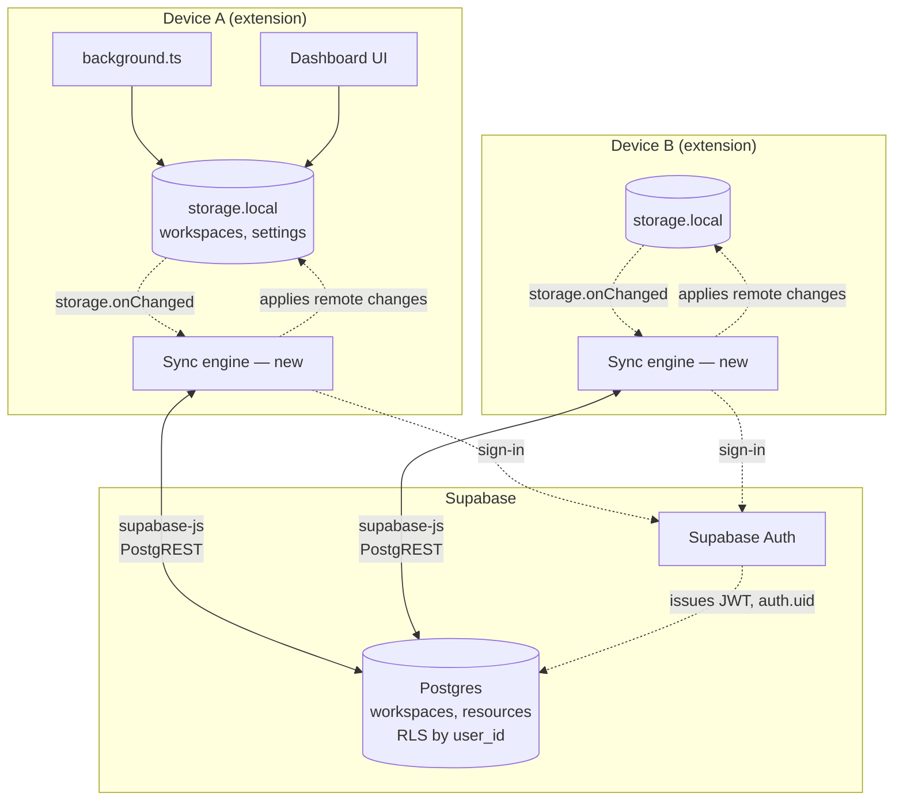
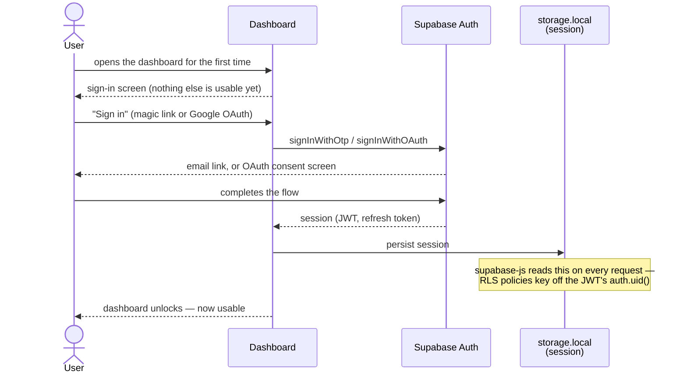
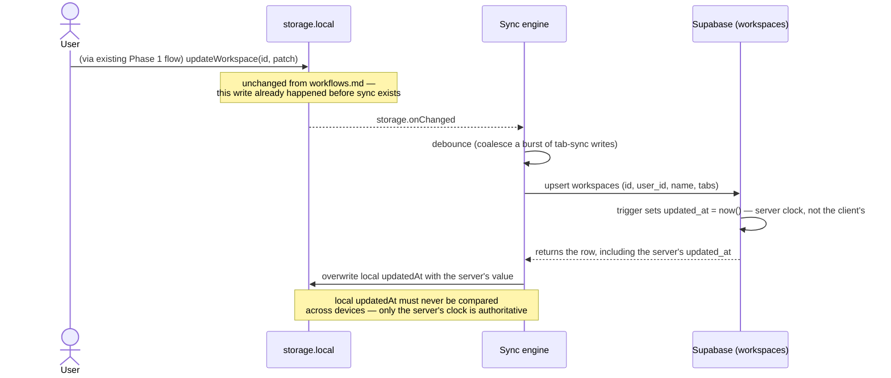
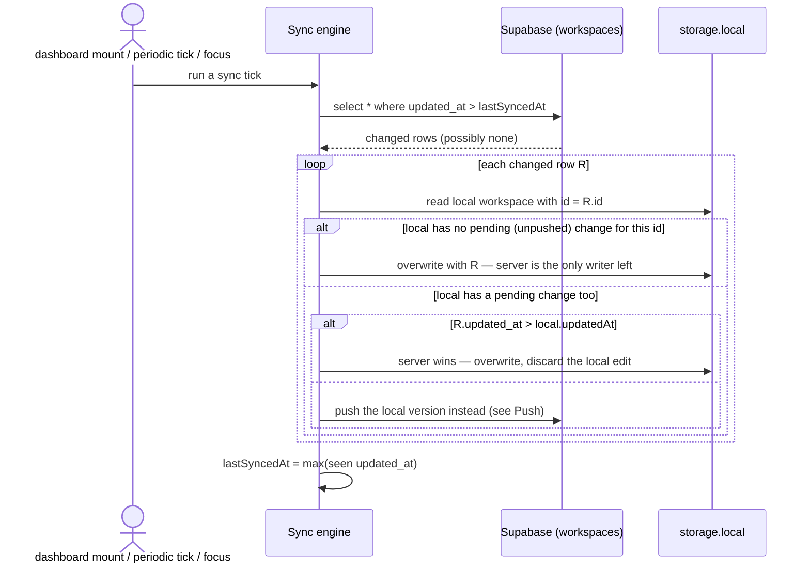
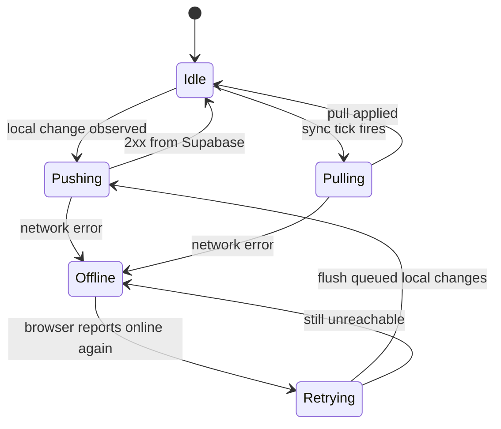
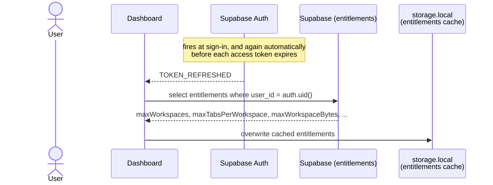
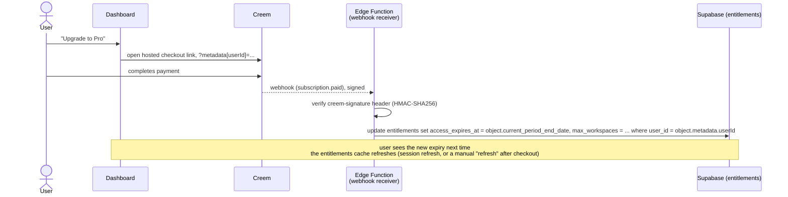

# Architecture: local-first, then sync

**Status: design document. Nothing on this page is implemented.**
`supabase/migrations/` has the target schema; the extension has zero sync or
auth code today. Unlike the original Phase 1/2 split in `ROADMAP.md` (local
use now, accounts later), this version requires an account **from first
use**, so the server can enforce plan limits — see "Accounts are mandatory"
below for why that doesn't collapse into a plain thin client. See
[`implementation-plan-sync.md`](./implementation-plan-sync.md) for the
ordered build plan this design turns into.

## Two separate questions this doc keeps distinct

1. **Is an account required to use cntxt at all?** Yes — settled by this
   revision. The server needs to know who you are to enforce usage limits,
   so sign-in gates the product before anything else happens.
2. **Does every read/write block on a network round-trip once you're signed
   in?** No, for almost everything. These are independent questions — the
   first is about who's allowed in the door, the second is about how fast
   things are once you're inside. Conflating them (network-required-for-
   auth ⇒ network-required-for-everything) was a mistake in an earlier draft
   of this document.

## Principle: local-first is a data-flow property, not a no-account promise

For every workspace operation _except creating a new workspace_ (see below),
the extension still reads and writes `storage.local`/`storage.session`
directly and instantly, never blocked on a network call — every diagram in
`workflows.md` continues to describe exactly what happens, unmodified. Sync
is **additive**: a background layer that mirrors that local state to
Supabase and pulls remote changes back in, without the save/close/restore
loop ever waiting on it.

Consequences of taking that seriously:

- Once a workspace exists, every local write to it (`updateWorkspace`, tab
  sync, ...) commits to `storage.local` first, full stop. Sync is notified
  after the fact, not in the write path.
- The UI (`App.tsx`) never has a loading spinner for "syncing" ordinary
  changes — it already re-renders from `storage.onChanged`, which fires the
  instant the local write lands, regardless of whether that write has
  reached the server yet.
- Going offline _after_ signing in loses nothing except cross-device sync
  itself and the ability to create a new workspace (see below) — everything
  else keeps working exactly as in `workflows.md`.

## Accounts are mandatory — why that doesn't make this a thin client

Signing in is a hard gate: there's no anonymous local-only mode, and no
"claim your existing local workspaces later" migration (an earlier draft of
this doc had one — deleted, since there's no pre-account period left for
orphan workspaces to exist in). That single gate is also where most server-dependency lives, but not the
only place — see "Entitlements" below for the general rule.

So "requires an account" and "local-first" aren't in tension; they apply to
different operations. The design goal is to keep the set of server-gated
operations small and explicit, driven by what the server actually needs to
protect (plan limits), not applied blanket to everything.

## Components



No custom API layer, per `ROADMAP.md`: the sync engine on each device talks
to Supabase directly via `supabase-js`. Postgres Row-Level Security (`auth.uid()
= user_id`) is what makes that safe — the server enforces isolation, so the
extension never has to.

## Auth — required before the dashboard does anything else

Not an optional upgrade offered later: on first run, the dashboard shows a
sign-in screen and nothing else until it succeeds. There's no "skip for
now."



## Push: local change → Supabase



The write to `storage.local` is exactly today's Phase 1 write — sync
observes it after the fact via `storage.onChanged`, the same mechanism the
dashboard already uses to react to background-script writes. It doesn't
insert itself into the save/close/restore path at all.

## Pull + conflict resolution

Phase 2 has no realtime requirement (that's Phase 3, per `ROADMAP.md`), so a
pull is just: fetch rows the server has touched since the last sync, and for
each one, take the server's copy if the server's version is the one that
should win.



This is genuinely last-write-wins with no merge: a true concurrent edit from
two devices loses one side's change entirely. `ROADMAP.md` accepts this
explicitly ("good enough for one user on multiple devices, no CRDT/merge
logic") — it's a real limitation, not an oversight, and it's the right
tradeoff for a product where one workspace is realistically driven by one
open browser window at a time.

## Offline handling



Nothing here blocks the local write itself — a queued/offline sync engine
just means "not synced yet," which is invisible to the save/close/restore
loop. `browser.storage.onChanged` already gives the dashboard live updates
regardless of network state, so there's no separate "offline banner" logic
needed for the core UI to stay correct.

## Local model vs. Postgres schema

|                       | Local (`utils/workspaces.ts`)           | Postgres (`supabase/migrations/...`)                             | Note                                                                                                                                                                                                             |
| --------------------- | --------------------------------------- | ---------------------------------------------------------------- | ---------------------------------------------------------------------------------------------------------------------------------------------------------------------------------------------------------------- |
| id                    | `crypto.randomUUID()`, client-generated | `uuid default gen_random_uuid()`                                 | Already compatible — locally-created ids need no remapping on first sync.                                                                                                                                        |
| name                  | `text`                                  | `text`                                                           | Direct.                                                                                                                                                                                                          |
| tabs                  | `WorkspaceTab[]` (`{url, title}`)       | `jsonb`                                                          | Direct serialization.                                                                                                                                                                                            |
| createdAt / updatedAt | `number` (client `Date.now()`)          | `timestamptz`, `updated_at` server-set via `moddatetime` trigger | **Not the same clock.** See Push diagram — after any round-trip, local `updatedAt` must be replaced with the server's value, never compared as client-generated ms against another device's client-generated ms. |
| ownership             | none (single-profile, implicit)         | `user_id` (RLS: `auth.uid() = user_id`)                          | No claiming step needed — every workspace is created after sign-in (see "Entitlements"), so it always has an owner from the moment it exists locally.                                                            |
| resources             | _(field doesn't exist yet)_             | `resources` table, FK to `workspaces`                            | Server schema is ahead of the client here: resources sync has nothing to sync until the Phase 1 "manually-added links/notes" capability (❌ in `capabilities.md`) is built locally.                              |
| deletion              | array filter, no tombstone              | hard `delete` cascades to `resources`                            | See open question below — a poll-based pull can't see "this row is now gone" the way it sees "this row changed."                                                                                                 |

## Entitlements: what the server gates, and how the client stays fast

Limits aren't only about how many workspaces exist — a tabs-per-workspace
cap or a workspace size cap are just as plausible, and more will likely show
up over time. Rather than hardcode "workspace creation is special," the
server exposes a small set of **entitlements** for the account (a plan's
limits), the client caches them locally for instant UX, and any write that
could exceed one goes through a server-side atomic check. The cache makes
the UI fast; it never makes the decision.

(Schema-wise this implies some `plans` / `account_limits` table keyed by
`user_id` or `plan_id` — not designed here, just assumed to exist.)

### Keeping the client's copy fresh: piggyback on session refresh

`supabase-js` already refreshes the access token on a timer before it
expires, and once at initial sign-in. Pulling entitlements on that same
event means no separate polling loop.



> **The cache is advisory, never authoritative.** It exists so the UI can
> gray out "New workspace" or show "approaching your tab limit" without a
> round-trip just to render that state. A stale or tampered local cache must
> never be what actually allows or blocks a write.

### The write-time check — resolved for workspace creation: local-first wins, sync is what's gated

An earlier draft of this doc had the entitlement check block workspace
creation itself — reject the write, and the workspace simply doesn't exist
yet. That's wrong for this product specifically:
`ensureWorkspaceForWindow` creates a workspace automatically every time a
browser window opens (see `CLAUDE.md`), with no click to intercept and no
UI in `background.ts` to show a rejection. Blocking that on a server
round-trip means opening a window while offline, or while already at your
plan's limit, would silently fail to create that window's workspace —
breaking the "every window is a workspace" guarantee the whole product is
built on. Resolved: creation is **local-first, unconditionally** — it never
fails, online or off, at-limit or not. What the entitlement actually gates
is whether that workspace gets a server-side counterpart at all.

```mermaid
sequenceDiagram
    actor User
    participant Dashboard
    participant Local as storage.local
    participant PG as Supabase

    User->>Dashboard: a new workspace (explicit click, or a window just opened)
    Dashboard->>Local: create it — always succeeds, no check first
    Note over Dashboard,Local: same commit as every other local-first write;<br/>the UI never waits on this
    Dashboard-->>PG: create_workspace RPC, fire-and-forget (same local id, so no remapping)
    alt under the limit and access not expired
        PG-->>Dashboard: row created — this workspace now has a synced counterpart
    else at the limit, expired, or offline
        PG-->>Dashboard: rejected or unreachable — silently ignored
        Note over Dashboard: the workspace stays exactly as usable, just unsynced —<br/>no error surfaced, no retry
    end
```

`extension/utils/workspaces.ts`'s `registerWorkspace` is this — a
non-blocking `.rpc('create_workspace', ...)` call whose result nobody
awaits or reports. The dashboard's cached entitlements (`utils/entitlements.ts`)
still gray out the "New workspace" button's tooltip as an early warning
("this won't sync"), but that's advisory framing only — clicking through
anyway still works, it just stays local-only, which is the whole point of
this design.

This resolves the offline question below for workspace creation
specifically; the equivalent question for a tab-count entitlement (no
click to intercept at all, not even an implicit one) is still open — see
below.

### Open problem: an entitlement with no click to intercept

Workspace creation is a deliberate action — there's a moment to say "no."
A tabs-per-workspace limit doesn't have that: tabs arrive via live sync
(`workflows.md` → "Live tab sync") as a side effect of ordinary browsing,
not a request the extension can reject. Undecided, and worth a product
call rather than an architectural default:

- Let the local workspace keep syncing past the limit, and only enforce it
  at push time — the local copy stays complete, but sync silently falls
  behind past the limit. "Fully backed up" quietly becomes false.
- Stop syncing new tabs into that workspace once the cached entitlement
  says it's full, and surface that in the dashboard. Keeps local and remote
  in agreement, but means cntxt visibly stops tracking tabs the user is
  still actively using.

## Payments (Creem)

Creem is the source of truth that _writes_ entitlements, not a separate
system alongside them: a purchase's only architectural job is to set
`entitlements.access_expires_at` (and, on this single-tier plan,
`max_workspaces`) for a user. Everything else in this document — the cache,
the write-time check, RLS — is unaware Creem exists; it only ever reads
those columns.

There's only one product shape, unlike the one-time-pass-plus-subscription
split an earlier draft of this doc assumed for Polar: Monthly and Yearly are
both plain recurring subscriptions. `subscription.paid` (not
`subscription.active`, which Creem's docs describe as "only for
synchronization") is the one event that grants access — extend
`access_expires_at` to the subscription's `current_period_end_date` on every
payment, and _don't_ retract it early on `subscription.canceled` (cancelling
stops future renewals, it doesn't claw back time already paid for).

Attaching our internal `user_id` to a purchase doesn't need a server-side
"create checkout session" API call at all: Creem's hosted checkout links
accept `metadata[key]=value` as a plain query parameter, and that metadata
round-trips onto the webhook payload untouched
(`extension/utils/creem.ts` builds this URL; see
`marketing/src/pages/index.astro` for the same product links used
unauthenticated on the marketing site).



**Why the webhook needs an Edge Function, not just a table write.** Creem
calls _our_ server — there's no user session attached to that request, so
it can't go through `supabase-js`/RLS as a normal authenticated write the
way every other table access in this document does. Something has to sit at
a public HTTPS endpoint, verify the payload actually came from Creem
(signature check), and only then write. Postgres has no notion of an
inbound HTTP endpoint, so this is unavoidably a second exception to "the
server is just tables and RLS" — alongside `create_workspace`, and for the
same underlying reason: an operation exists that a bare client-side insert
cannot safely perform. Implemented: `supabase/functions/creem-webhook/`.

**Enforcement has to live in RLS, not the entitlements cache.** Everywhere
else in this document, the client-side entitlements cache is explicitly
_advisory_ — a UX shortcut, never the actual gate. Expiry is the one place
that distinction really matters for the business model: if an expired
user's writes still succeed because nothing at the database layer checks
`access_expires_at`, the "N-year pass caps hosting cost" premise in the
pricing plan isn't actually true — it's just a payment schedule with no
enforcement behind it. The relevant `workspaces` RLS policies need
`access_expires_at > now()` added to their `using`/`with check` clauses (or
a small SQL helper function wrapping that check), not just a read in
application code.

**Open question, not resolved by the pricing plan:** what happens to a
user's synced data the moment their pass lapses? Candidates — freeze writes
but keep serving reads (cheapest to build, storage cost doesn't shrink),
drop back to local-only (extension keeps working, sync stops, matches
Phase 1's original offline-first behavior), or delete server-side data after
some grace period (the only option that actually reclaims the storage cost
the pricing table is optimizing for). This is a product decision the pricing
math assumes an answer to but doesn't supply one.

- **Delete propagation.** A poll comparing `updated_at` never notices a row
  that's now _absent_. Either add a `deleted_at` soft-delete column (delete
  becomes an update, fits the existing poll) or have each pull tick fetch
  the full remote id set and locally-delete anything missing from it. Soft
  delete is the smaller change to the sync engine; it does mean adding a
  filter (`where deleted_at is null`) everywhere the app currently reads
  `workspaces` outright.
- **Push batching.** Live tab sync (`workflows.md` → "Live tab sync") can
  fire several `updateWorkspace` calls in quick succession while someone's
  actively browsing. The Push diagram above debounces before hitting
  Supabase — without that, a busy window would generate a write per tab
  event.
- **Resources sync is blocked**, not just unbuilt: the local `Workspace`
  type has nowhere to put a resource yet, so this is a schema dependency,
  not a sync-layer task.
- **What happens offline at the point of an entitlement-gated write?**
  Resolved for workspace creation — see "The write-time check" above:
  creation always succeeds locally, offline or not; the entitlement check
  only gates whether it gets a synced server-side counterpart. Still open
  for any future entitlement that isn't tied to a creation event at all
  (e.g. a tabs-per-workspace or size cap) — see the tab-count problem
  below.
- **The tab-count entitlement problem has no chosen answer** — see
  "Entitlements → Open problem" above.

## Explicit non-goals

- No CRDT or field-level merge — last-write-wins, whole-row.
- No custom API server — `supabase-js` talks to PostgREST/Auth directly,
  except the `create_workspace` RPC (atomic limit enforcement) and the
  Polar webhook Edge Function (the only inbound request with no user
  session to authenticate it through RLS). Two exceptions, both because an
  operation exists that a plain client-side table call cannot safely do —
  not a sign the rule is soft.
- No realtime subscriptions yet — see `ROADMAP.md` Phase 3 for the
  team-live-updates upgrade this schema is meant to support later.
- No anonymous or local-only mode — this supersedes `ROADMAP.md`'s original
  Phase 1 (local-only) / Phase 2 (add accounts) split. Worth reconciling
  `ROADMAP.md` itself with this if the mandatory-account decision is final —
  it currently still describes Phase 1 as usable without signing in.
