# Workflows

Sequence diagrams for the ✅ capabilities in [`capabilities.md`](./capabilities.md).
Each one pairs two levels: **"What you experience"** — just the user and
Vistap as a black box, the goal it serves — and **"Under the hood"** — traced
directly from the current code (`extension/entrypoints/background.ts`,
`utils/attach.ts`, `utils/restoreMachine.ts`, `utils/workspaceWindowMachine.ts`).
The "under the hood" diagrams are accurate to what runs today — update them
alongside the code, not after the fact.

For ❌ capabilities there's no real flow to trace yet, so those sections are
short prose **scenarios** instead of diagrams: a sketch of the intended user
experience per the `Workspace Dashboard v2` design, not a spec.

## Capture & restore

### Opening a window for the first time (icon click)

The path that creates a workspace from whatever tabs are already open, the
first time you click the extension icon in a window that has no mapping yet.

**What you experience:**

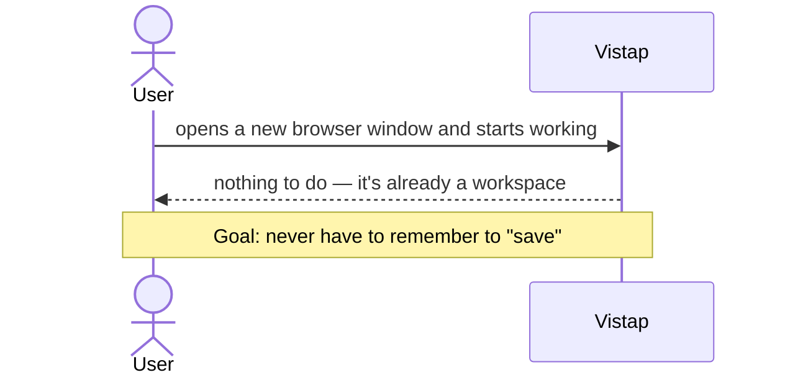

**Under the hood:**

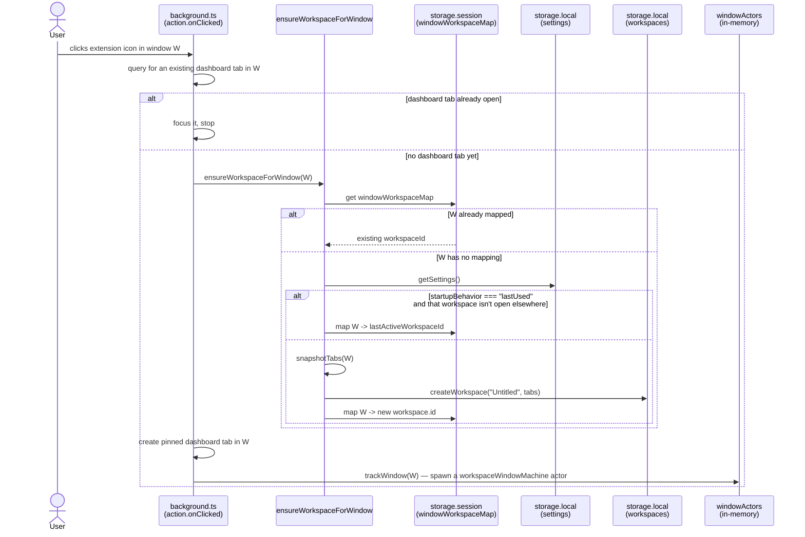

### Live tab sync

Every tab change in a tracked window re-snapshots that window's tabs into
its mapped workspace — this is what makes "saving" invisible.

**What you experience:**

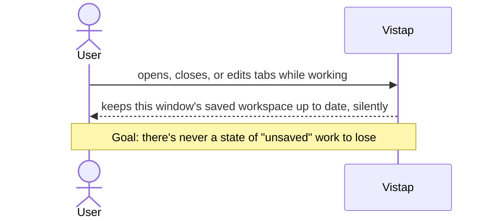

**Under the hood:**

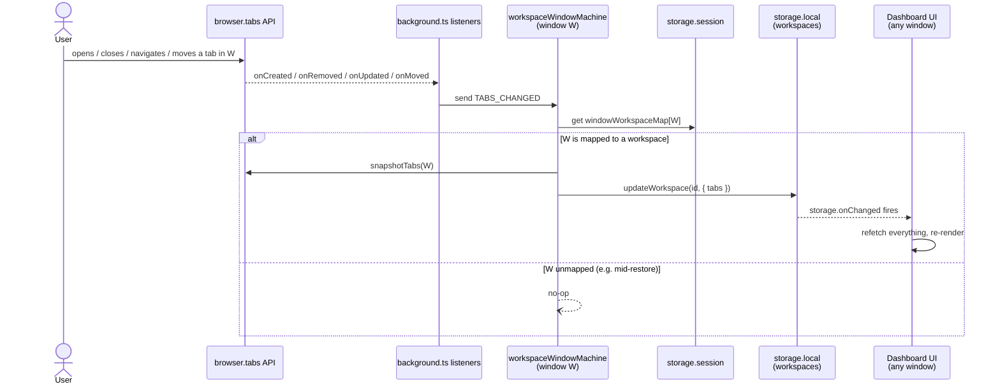

### Service worker rehydration

MV3 background scripts restart often (idle unload, browser restart). The
in-memory actor registry doesn't survive that, so it's rebuilt from
persisted session state on every wake — this is called out in `CLAUDE.md`
as load-bearing, not incidental.

**Why it matters to you:** purely internal reliability plumbing — nothing to
diagram from the user's side, since the point is that you never notice it
happened. A tab you were tracking never silently stops syncing just because
the browser put the extension to sleep.

**Under the hood:**

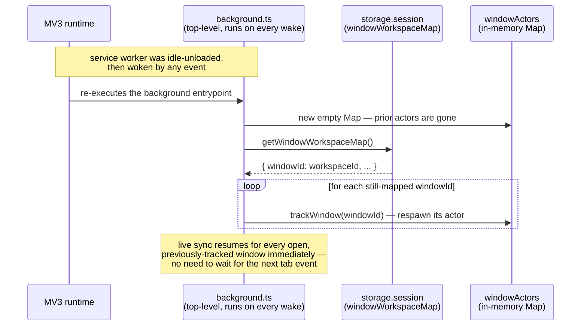

### Startup: resume last-used workspace

Runs once per browser launch, for every already-open window, when
`settings.startupBehavior === "lastUsed"`.

**What you experience:**

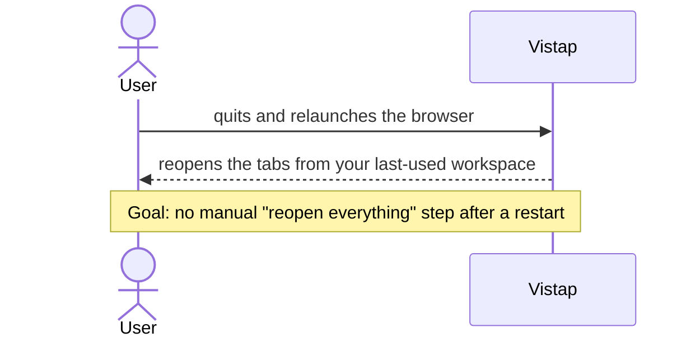

**Under the hood:**

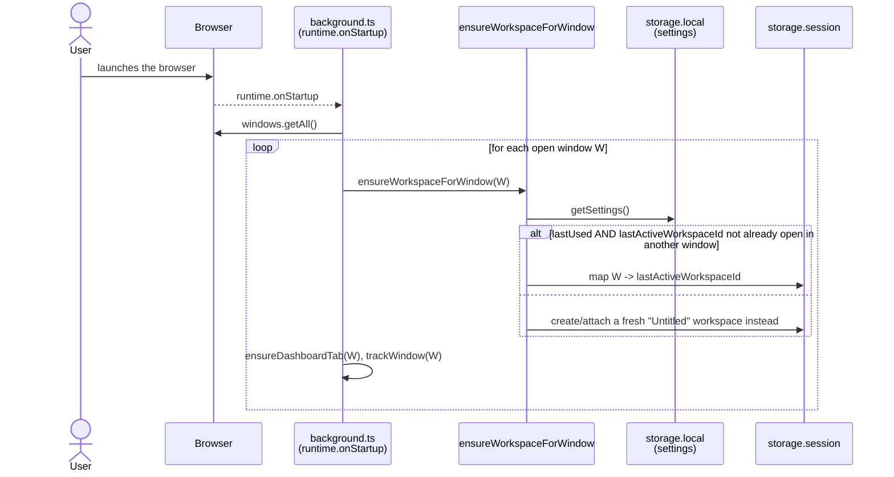

### Close all tabs

The simple half of `restoreMachine`: no workspace switch, so the window
stays mapped to its current workspace throughout.

**What you experience:**

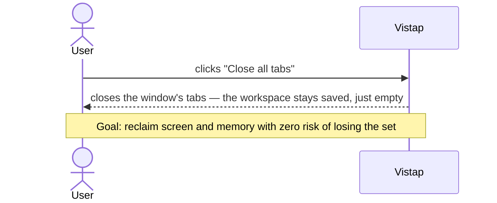

**Under the hood:**

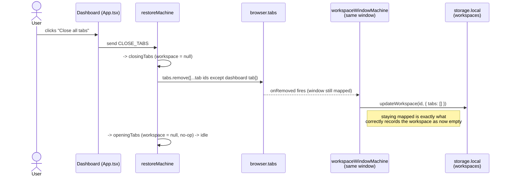

### Restore / switch workspace

The subtle one: restoring into the _current_ window is a close-then-open,
and the outgoing workspace must be detached **before** its tabs close — or
live-sync would zero out the workspace being left behind instead of the one
being closed. Covered by `utils/restoreMachine.test.ts`.

**What you experience:**

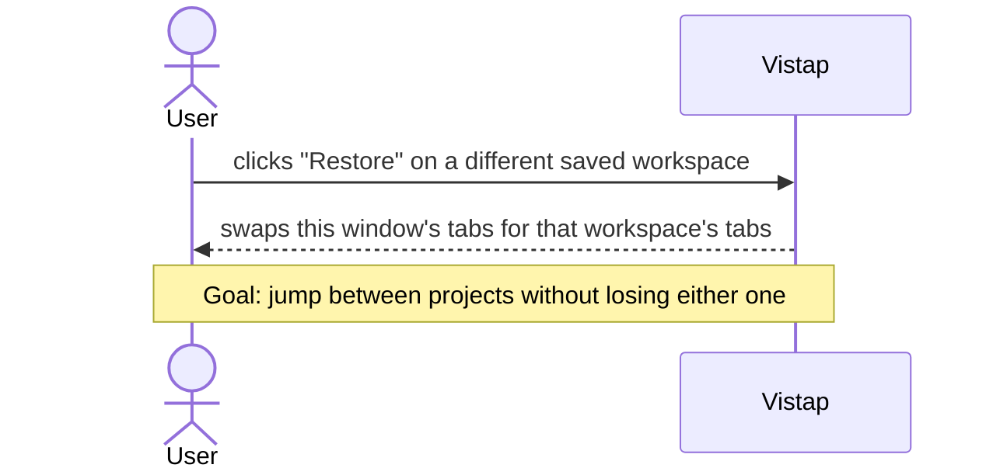

**Under the hood:**

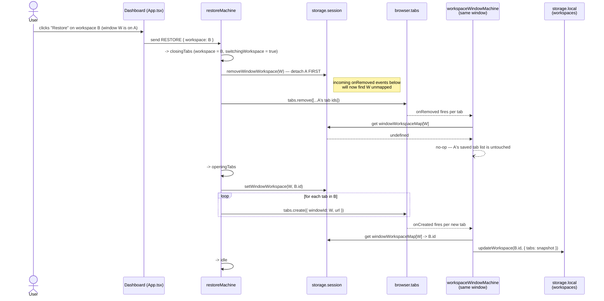

### Rename / delete a workspace

Plain CRUD, no diagram needed: the dashboard calls `updateWorkspace`/
`deleteWorkspace` directly, then re-fetches. No window-mutating side effects,
no machine involved.

## Organization — not implemented

**Scenario:** you drag a tab out of "Sync engines" into a new "Read later"
section within the same workspace; the tab's row picks up the section's
color dot. Selecting three tabs with click+shift and hitting a workspace
name in the bottom bar moves all three there in one action instead of three
separate drags.

Needs a schema change first — `Workspace.tabs: WorkspaceTab[]` becomes
`Workspace.sections: { id, name, color, tabs }[]` — before any of the above
has somewhere to live.

## Navigation & search — not implemented

**Scenario:** with a dozen workspaces open across projects, you hit `⌘K`,
type part of a tab's title, and jump straight to it without knowing which
workspace it's in — or collapse the sidebar into a pill that still shows the
active workspace's name and tab count.

## Live-open-tabs panel — not implemented

**Scenario, and why it doesn't fit as designed:** a right-hand panel lists
tabs open in the browser that aren't in any workspace yet, each with its own
"Save" button. That presumes some windows aren't auto-attached — the
opposite of "every window is a workspace." Building this means first
deciding whether some windows should opt out of live-sync, not just adding
UI.

## Sync & collaboration — not implemented (Phase 2/3, per `ROADMAP.md`)

**Scenario:** you save a workspace on your laptop, open the browser on a
different machine signed into the same account, and it's already there —
`updated_at` last-write-wins, no merge UI. In Phase 3, a teammate opens the
same shared workspace and sees your tab list update in real time via
Supabase Realtime.
